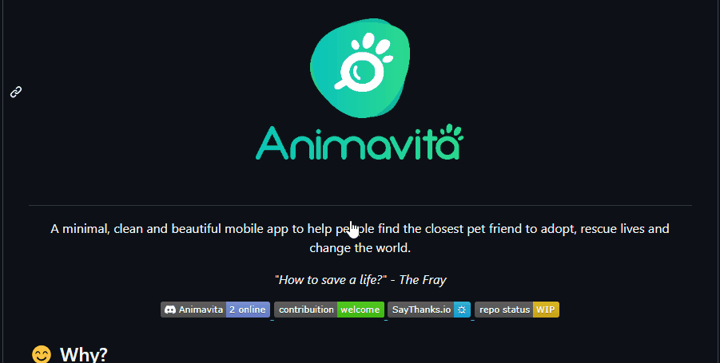

# Repositório com README
Primeiro projeto de teste de um arquivo com README 🐱‍👤🐱‍🏍🐱‍👓


[]


## Tecnologias Utilizadas

- HTML
- CSS
- JS

## Como utilizar

Clone o projeto
```
git clone
```
```
<url>
```

## Experiencias adquiridas com o decorrer do projeto (exemplo)

## Colaboradores